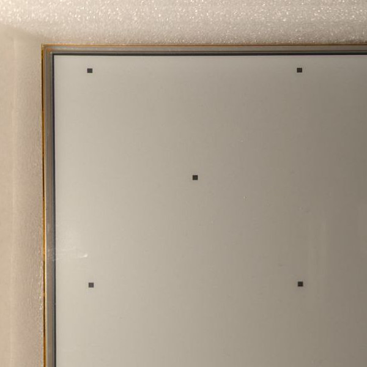
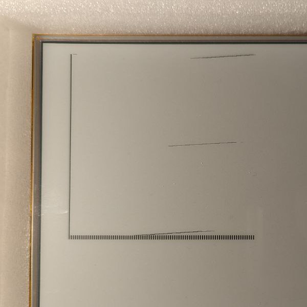

# IT8951 1bpp A2_MODE emulator

Small utility for developing graphic interfaces for the IT8951 EPD driver, in particular with the 10.3" Waveshare display.

This is a quick and dirty tool made to be able to visualize
my development without carrying a screen taped to styrofoam on the train 😅

# The display and data load alignment

While testing out modifications of the [Waveshare sample code](https://github.com/waveshare/IT8951-ePaper/tree/master/Raspberry/), I ran into problems when the X px coordinates of an image load do not align with 4 bytes.

The controller seems to be rounding the x coordinates up to the nearest 4 byte alignment, and the width of the image will also get deformed if the original x coordinate was not 2-byte aligned.

## Aligment problems examples
Here are some examples of drawing the same picture (test image, with squares in the corners and a square in the middle) with different offsets.

The drawing and displaying to the e-ink display works in two steps:
  - You load the image into the driver's memory
  - You command the display to reveal a portion of the memory

The revealing part works with any coordinates, but the loading part needs the x
coordinate to be aligned to 4 bytes.

### X is 4 byte aligned

Everything seems to work fine when you write images to 4 byte aligned x.

In this case, to x=96px (12 bytes considering 1bpp)

### X is 8 bits off 4-byte alignment

The funnies start when you are 8 bits off. The start position of the
image gets rounded up to the next 4 byte algined x coordinate... and for
each row an extra byte from the next row is taken. This causes the image to
get displaced and deformed.

The display is initialized with all bits to 0xF0 (0b11110000), which means that unwritten sectors of the memory will be displayed as vertical stripes. Because the
load part gets aligned to 4 bytes but not the display part, we see part of the not painted section (3 bytes wide to be precise, 3 sets of black and white stripes).

Writing the test image to x=104px (13 bytes)

### X is 16 bits off 4-byte alignment

When you are 16 bits off, the start position is still rounded up to the 4 byte aligned x (you see some uninitialized memory with the striped pattern), but the length of each row is preserved.

Writing the test image to x=112px (14 bytes)

### X is 24 bits off 4-byte alignment

Again the image will get deformed, the same way as the case for 8-bit off the alignment.

Test image drawn at x=120px (15 bytes).

# Screenshots from the program

Here are two screenshots from the window created by the utility. They match the first two alignment cases respectively.

# Requirements

For the window and pixel painting, the program requires SDL2 libs installed in the system.

I've only used this under linux, shouldn't be too hard to run it on any other platform.

# Limitations

For now, the limitations are:

  - Only one screen possible
  - Only supports 1bpp (bits-per-pixel) because it is anyway the only bpp setting
supported by the A2 mode for fast partial updates of the screen.
  - No timing emulation, everything will be loaded asap and displayed when called asap. Adding timing emulation is probably my next step after I finish the GUI library.

# Example

You can run `make example` to generate an example binary that writes the test image described in the alignments section.

The code for that is in [src/example.c](src/example.c)